# Educación para la Salud Digital
## Estudio en adolescentes tras el ayuno del smartphone durante 24 horas
**Curso 2025–2026 · Zona noroeste de Extremadura**

---

> **Nota para el desarrollador:** Las imágenes están referenciadas con rutas relativas `assets/graficos/imageXXX.png` — copia la carpeta `graficos/` extraída del .docx dentro de `assets/` en tu proyecto. Las secciones marcadas con `[STAT]` son datos destacados que deben mostrarse como *cards* o *callouts* visuales destacados.

---

## Autores

- **Mª Magdalena Ríos de la Torre** — Veterinaria de EAP, Servicio Extremeño de Salud
- **José Eloy Lucas Durán** — Veterinario de EAP y Director del Centro de Salud de Torrejoncillo (Cáceres), Servicio Extremeño de Salud
- **Vicenta Jiménez Peralta** — Educadora Social, IESO Vía Dalmacia de Torrejoncillo (Cáceres)
- **José Pedro Martín Lorenzo** — Profesor de Matemáticas y Director del IESO Vía Dalmacia de Torrejoncillo (Cáceres)

---

## Resumen ejecutivo

El estudio analiza el impacto de la tecnología en jóvenes de **14 y 15 años** procedentes de **8 centros educativos** del norte de Extremadura. Mediante la retirada del teléfono móvil durante **24 horas**, se evaluaron los efectos psicológicos, físicos y relacionales de la desconexión.

### Cifras clave

> [STAT] **328** alumnos convocados · **125** completaron el ayuno (38,1%) · **108** familias respondieron el cuestionario

> [STAT] **5 horas diarias** de uso medio del móvil · **25,6%** siente nerviosismo sin el móvil · **84,8%** consulta notificaciones de forma constante

> [STAT] **80%** reconoce que el móvil reduce su tiempo familiar · **95,4%** de padres desconoce si sus hijos sufren agresiones digitales

> [STAT] **50,4%** mejoró su concentración escolar durante el ayuno · **76%** disfrutó de tener tiempo para otras actividades

---

## Introducción

La revolución digital ha dejado de ser un fenómeno técnico para convertirse en una transformación estructural de la sociedad. En España, la conectividad es ubicua: **a los 10 años, el 41% de los niños ya tiene móvil propio**, cifra que asciende al 76% a los 12 años y se generaliza casi al 100% en la adolescencia tardía.

Esta «hiperconectividad» plantea un desafío de salud pública que la OMS señaló desde 2014: el uso excesivo de pantallas sin acompañamiento tiene repercusiones profundas en el desarrollo infantil.

El cerebro adolescente está en plena maduración del córtex prefrontal —responsable del autocontrol y la toma de decisiones—. Los estímulos digitales activan el sistema de recompensa cerebral a través de la dopamina, generando una gratificación inmediata que puede derivar en **patrones de conducta adictiva** similares a los de las sustancias químicas.

La Sociedad Española de Neurología alerta sobre el fenómeno del *«brain rot»* (deterioro cognitivo por consumo excesivo de contenidos triviales), asociado a la reducción de la capacidad de concentración, la memoria y la creatividad.

Uno de los hallazgos más preocupantes en investigaciones recientes es la desconexión entre jóvenes y familias: existe una **«bolsa de silencio»** porque los adolescentes ocultan sus problemas digitales por miedo a que la respuesta protectora sea la retirada del dispositivo.

Este proyecto no aboga por la prohibición —que a menudo genera reactancia— sino por la **Higiene Digital**: al igual que la salud bucodental es una norma social establecida, la salud digital debe instaurarse desde la infancia.

---

## Objetivos

### Objetivo principal
Evaluar el impacto de las nuevas tecnologías en adolescentes mediante el análisis de los efectos psicológicos y comportamentales derivados de la retirada del teléfono móvil durante **24 horas**, comprendiendo su repercusión en el bienestar personal y en las relaciones familiares y sociales.

### Objetivos secundarios

1. **Identificar riesgos de salud** — Informar sobre adicción, molestias físicas, sedentarismo e insomnio derivados del uso inadecuado.
2. **Fomentar la autorregulación** — Ayudar a los jóvenes a reconocer la ansiedad o *nomofobia* y promover un uso equilibrado.
3. **Analizar la brecha de percepción familiar** — Detectar discrepancias entre lo que los padres creen controlar y el uso real de sus hijos, especialmente en ciberacoso.
4. **Evaluar diferencias por entorno** — Determinar si el entorno rural frente al urbano condiciona los hábitos de hiperconectividad.
5. **Estudiar patrones por sexo** — Analizar cómo el género condiciona el tipo de uso y los niveles de dependencia.
6. **Promover el ocio *offline*** — Favorecer el deporte, la lectura y la convivencia presencial para reducir la dependencia tecnológica.
7. **Detectar conductas de riesgo invisibles** — Evaluar ciberacoso, acceso a contenidos inapropiados y compras compulsivas.
8. **Validar la eficacia de incentivos** — Analizar si el incentivo económico es suficiente para vencer la dependencia hacia la «identidad digital».

---

## Metodología

### Participantes
- **328 alumnos** de 3º de la ESO, edades entre 14 y 15 años
- **8 institutos** del noroeste de Extremadura: 6 rurales y 2 urbanos (Coria, >10.000 hab.)
- Estudio avalado por la **UPE** (Unidad de Programas Educativos de Cáceres) y coordinado por los CPR de Coria, Hoyos y Plasencia

**Centros participantes:** IES Alagón de Coria · IES Caurium de Coria · IESO Cella Vinaria de Ceclavín · IES Gabriel y Galán de Montehermoso · IES Jálama de Moraleja · IESO Val de Xálima de Valverde del Fresno · IESO Valles de Gata de Hoyos · IESO Vía Dalmacia de Torrejoncillo

### Participación
De los 328 alumnos convocados, **125 (38,1%) completaron el ayuno**. El 61,9% rechazó participar aun con incentivo económico —dato que por sí mismo evidencia la profundidad de la dependencia.

Incentivo: cheque regalo de **25 euros** por completar el ayuno.

### Fases del estudio

**Fase 1 — Cuestionario previo (noviembre–diciembre 2025)**
24 preguntas sobre hábitos de uso, horas de conexión (media diaria de los últimos 7 días) y emociones asociadas al móvil. Los alumnos consultaron sus propios datos de uso en el dispositivo.

**Fase 2 — Ayuno digital**
Los terminales fueron apagados, precintados en una bolsa identificada y custodiados por el equipo coordinador durante exactamente 24 horas.

**Fase 3 — Cuestionario posterior**
10 preguntas sobre sentimientos durante la ausencia, cambios de comportamiento, actividades alternativas y notificaciones acumuladas.

**Fase 4 — Cuestionario a familias**
16 preguntas enviadas a progenitores. Se recibieron **108 respuestas** (84,2% madres, 15,7% padres), permitiendo un análisis de correlación entre hijos y familias.

---

## Resultados

### 1. Perfil de la muestra

- **Por sexo:** 53,6% chicos · 46,4% chicas
- **Por entorno:** 80,8% entorno rural · 19,2% entorno urbano

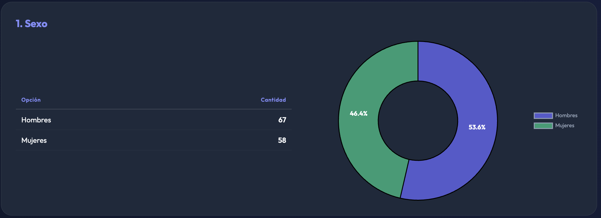
*Distribución por sexo de los participantes*

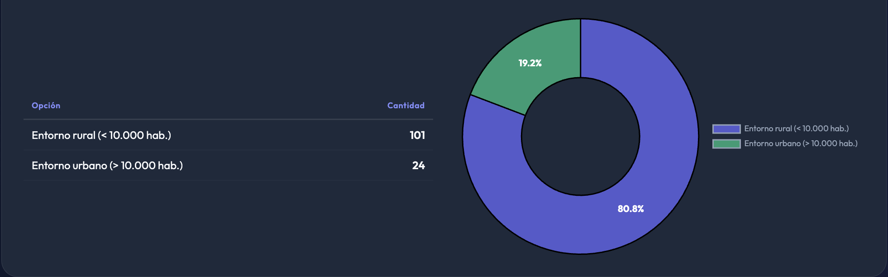
*Distribución por entorno rural/urbano*

---

### 2. Estado emocional y dependencia

> [STAT] **1 de cada 4 alumnos** (25,6%) siente nerviosismo o inquietud cuando no puede consultar el móvil. En las chicas, este porcentaje es **3 veces mayor** que en los chicos.

> [STAT] Solo el **15,2%** afirma no revisar las notificaciones nunca o casi nunca.

La consulta compulsiva de notificaciones refleja una **alta dependencia informativa y social** del dispositivo. Las alumnas comprueban las notificaciones con mayor frecuencia, asociado a un uso más intensivo de la mensajería y las redes sociales.

**Brecha familias–alumnado:** Los adolescentes manifiestan más ansiedad de la que perciben sus familias. Parte del malestar no es visible desde fuera, o los propios jóvenes lo normalizan y no lo expresan en casa.

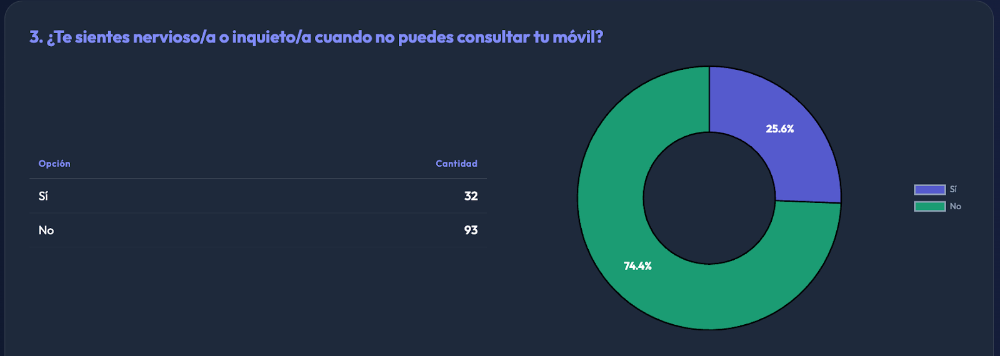
*Nerviosismo sin móvil — resultado global*

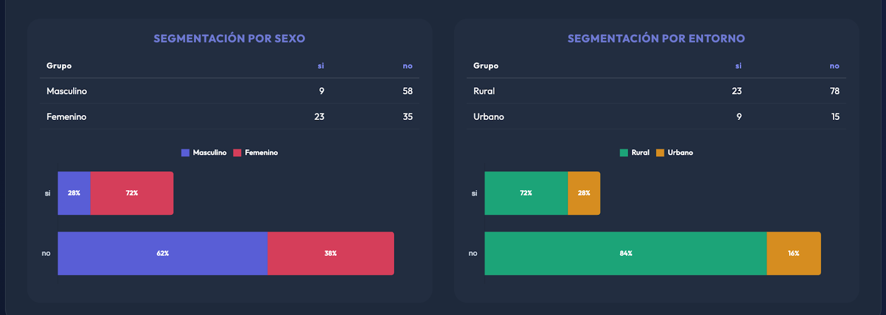
*Nerviosismo sin móvil — segmentación por sexo*

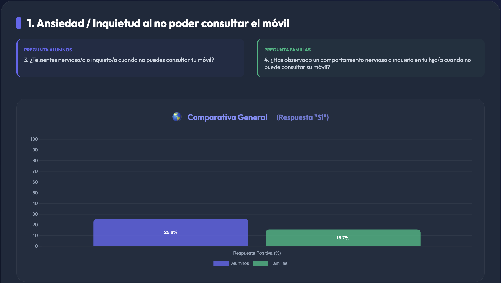
*Nerviosismo sin móvil — correlación alumnado/familias*

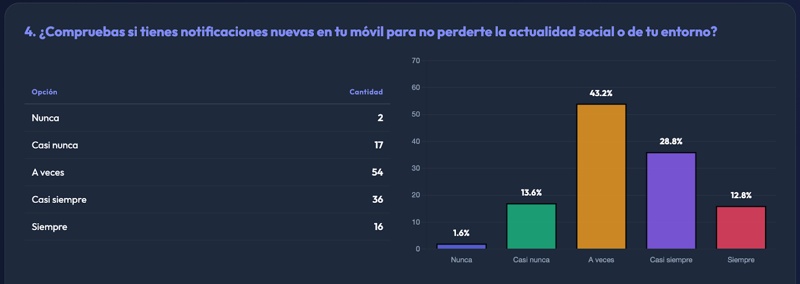
*Consulta de notificaciones — resultado global*

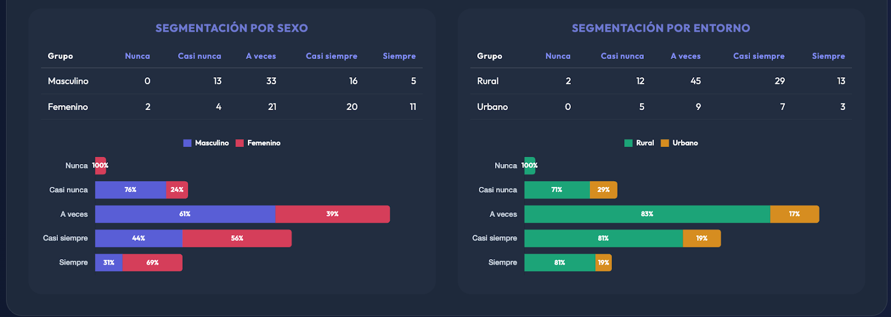
*Consulta de notificaciones — segmentación por sexo*

---

### 3. Relaciones familiares

> [STAT] **8 de cada 10 jóvenes** creen que podrían interactuar más con su familia si usaran menos el móvil.

> [STAT] Solo **1 de cada 3 estudiantes** tiene supervisión parental real de contenidos.

> [STAT] El **75% de las familias** afirma controlar el tiempo de uso, pero solo el **30% de los hijos** percibe ese control.

El móvil se ha convertido en un **motivo recurrente de conflicto familiar**: aproximadamente la mitad del alumnado reconoce que sus padres les riñen por el uso excesivo. Sin embargo, los padres reaccionan y corrigen, pero no regulan ni supervisan de forma preventiva.

Las familias perciben más el impacto del móvil en las hijas que en los hijos, lo que sugiere una mayor preocupación parental por el uso femenino.

**Conclusión:** Las estrategias familiares se centran más en la **corrección** (reñir) que en la **prevención** mediante supervisión y acompañamiento digital.

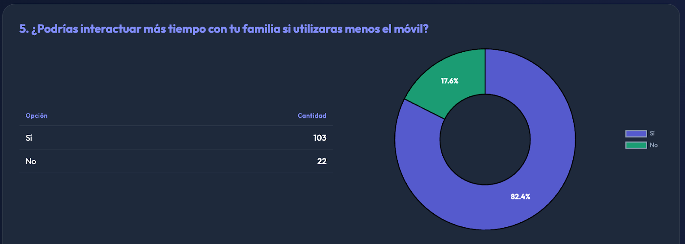
*Interacción familiar — resultado global*

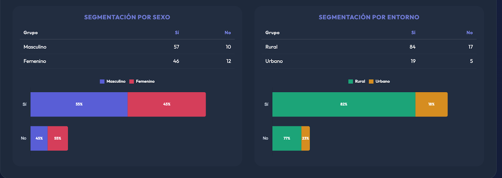
*Interacción familiar — segmentación por sexo*

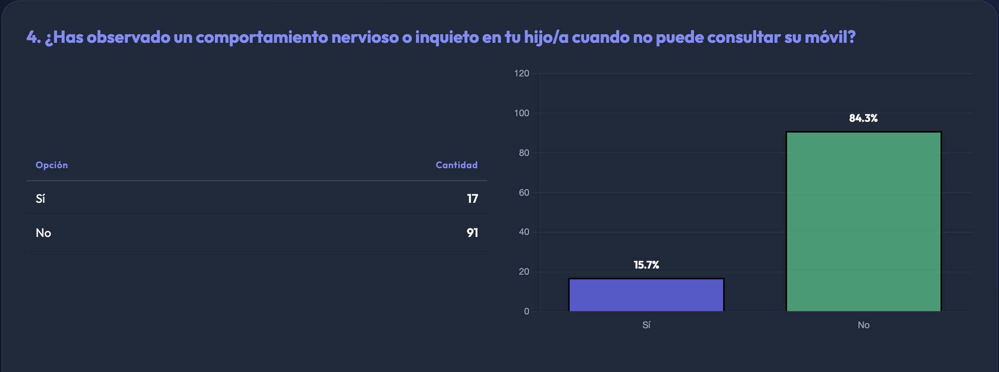
*Interacción familiar — segmentación por entorno*

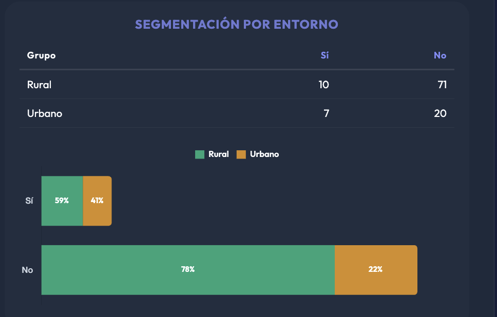
*Interacción familiar — correlación alumnado/familias*

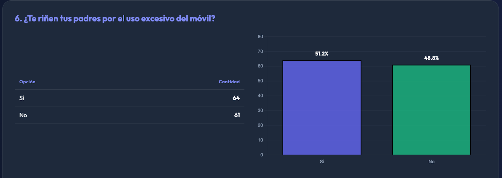
*Conflictos familiares por el móvil — resultado global*

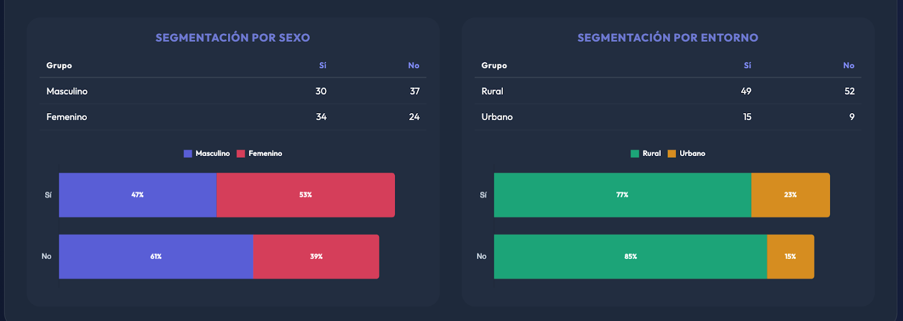
*Conflictos familiares — segmentación por sexo*

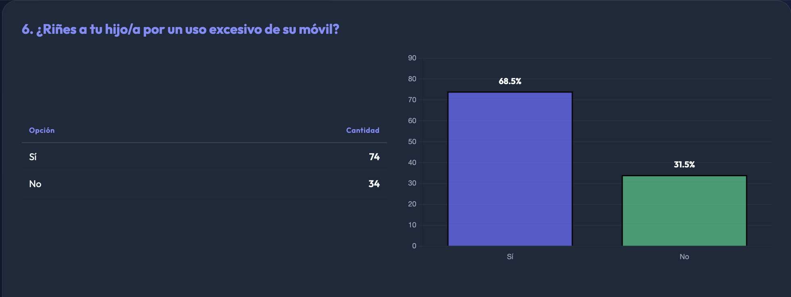
*Conflictos familiares — segmentación por entorno*

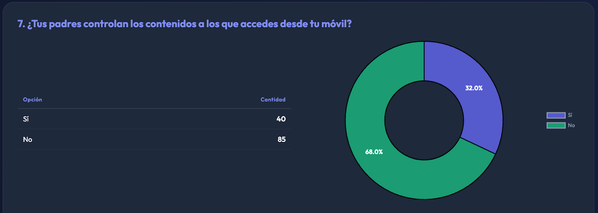
*Conflictos familiares — resultado familias*

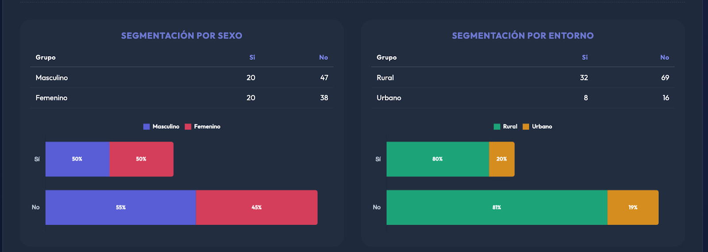
*Control parental de contenidos — resultado alumnado*

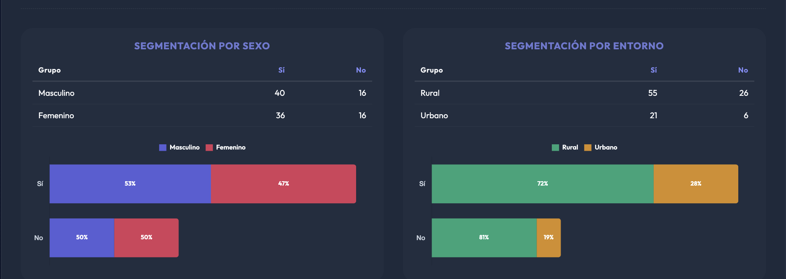
*Control parental de contenidos — correlación alumnado/familias*

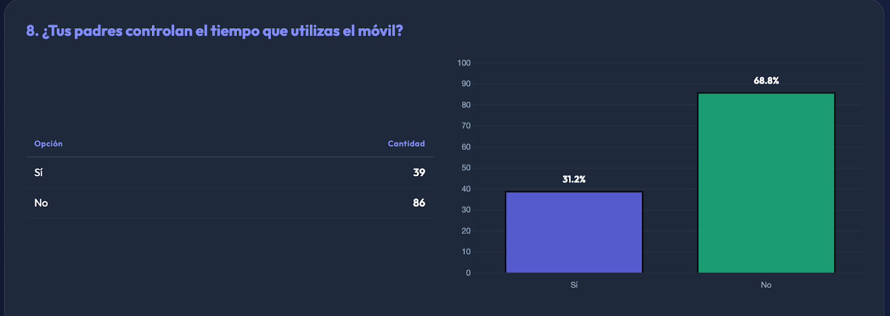
*Control parental de tiempo — resultado alumnado*

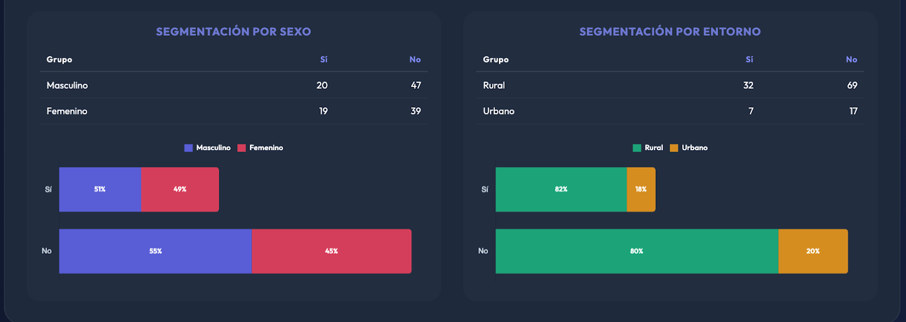
*Control parental de tiempo — segmentación por sexo*

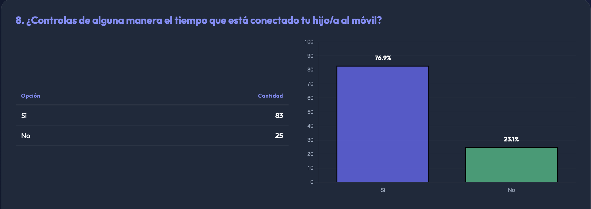
*Control parental de tiempo — correlación alumnado/familias*

---

### 4. Salud física: señales de alerta

> [STAT] **44%** padece dolor o rigidez de cuello y espalda · **26,4%** sufre molestias oculares de forma ocasional o habitual.

Estas dolencias **no son síntomas aislados**, sino indicadores clínicos de un patrón de uso intensivo. La postura inclinada hacia la pantalla genera una carga excesiva en las vértebras cervicales, derivando en dolor de cabeza, fatiga y rigidez de cuello.

**Brecha de género:** El 67% de quienes reportan rigidez de cuello habitual son chicas. El 75% de los casos de molestias oculares habituales corresponde a adolescentes femeninas.

**Concordancia familiar:** Los progenitores perciben incluso más los dolores de cuello y espalda que sus hijos (51,9% frente al 44%), lo que indica que este síntoma sí es visible desde el entorno adulto.

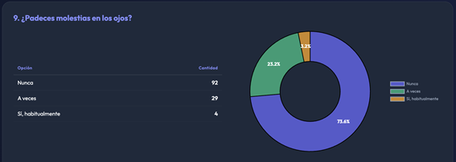
*Molestias oculares — resultado global alumnado*

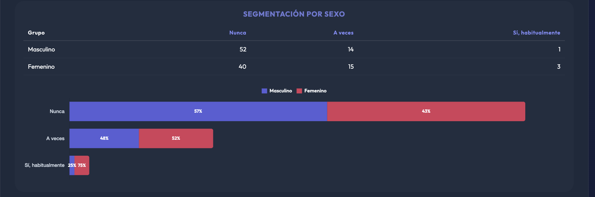
*Molestias oculares — segmentación por sexo*

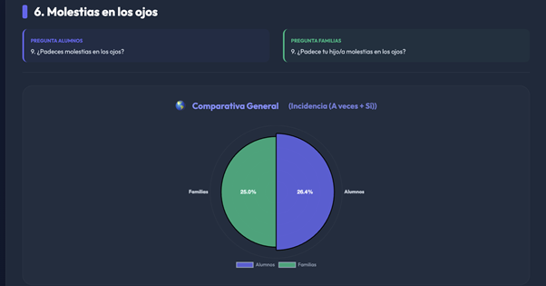
*Molestias oculares — correlación alumnado/familias*

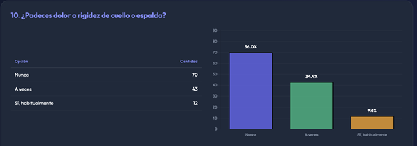
*Dolor cuello/espalda — resultado global alumnado*

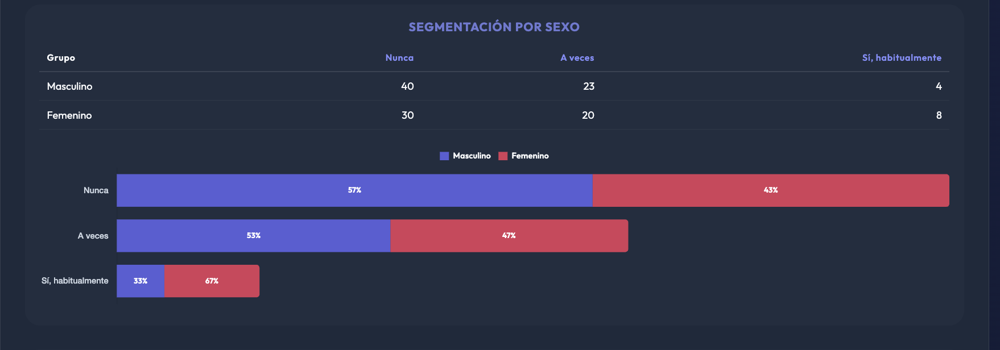
*Dolor cuello/espalda — segmentación por sexo*

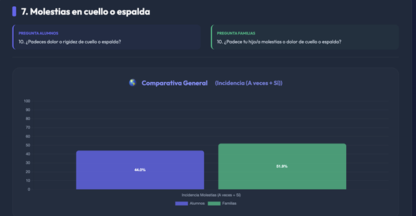
*Dolor cuello/espalda — correlación alumnado/familias*

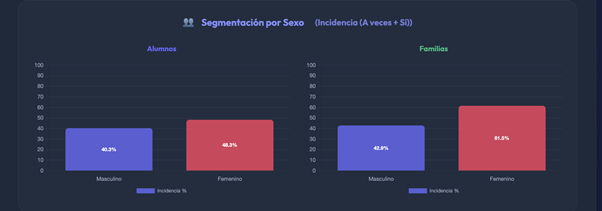
*Dolor cuello/espalda — segmentación por sexo en familias*

---

### 5. Ciberacoso: «la brecha de silencio»

> [STAT] **7,2%** reconoce haber sido víctima de burlas o insultos en redes sociales · **6,4%** admite haber insultado o burlado de compañeros · **17,6%** ha sido testigo de acoso a terceros.

> [STAT] **95,4% de los padres desconoce** si sus hijos sufren o presencian agresiones digitales.

> [STAT] **18,4%** ha visto publicadas fotos o vídeos suyos **sin su consentimiento**.

> [STAT] **24%** ha recibido contenidos pornográficos y/o violentos. En chicos, este porcentaje sube al **35,8%**.

#### La figura del testigo digital
El porcentaje de observadores (17,6%) es notablemente superior al de víctimas (7,2%) o agresores (6,4%), lo que confirma que el ciberacoso **tiene alta visibilidad social entre iguales** pero permanece invisible para los adultos.

#### La brecha de silencio
Los adolescentes callan por **miedo a que les retiren el móvil** como medida de protección. Esta dinámica impide que las familias actúen de forma proactiva y deja la resolución del conflicto exclusivamente en manos de los jóvenes.

#### Vulneración de la soberanía digital
La publicación de fotos o vídeos sin consentimiento afecta de forma transversal a toda la muestra, sin diferencias significativas por sexo o entorno. La inmediatez digital y la búsqueda de aceptación social eliminan los filtros éticos ante la privacidad ajena.

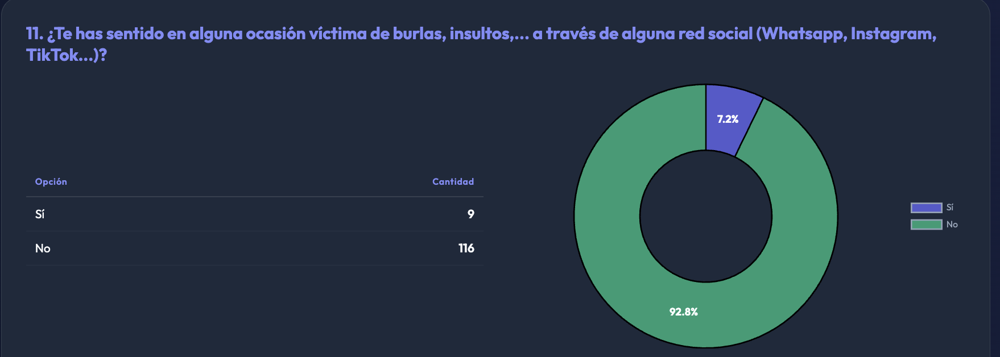
*Victimización ciberacoso — resultado global*

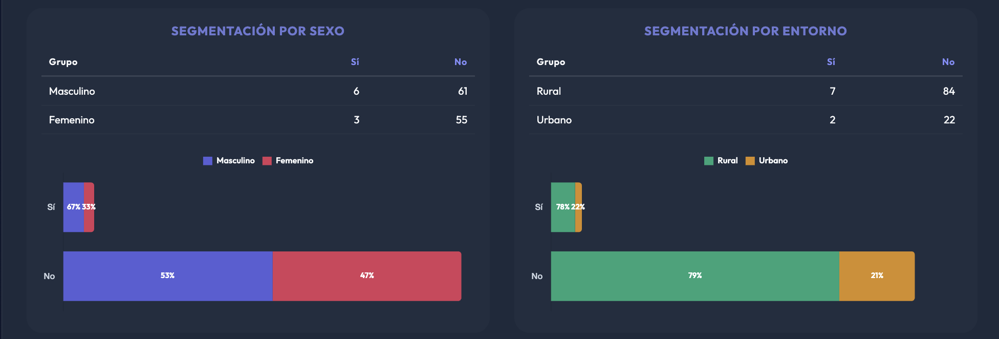
*Victimización ciberacoso — segmentación por entorno*

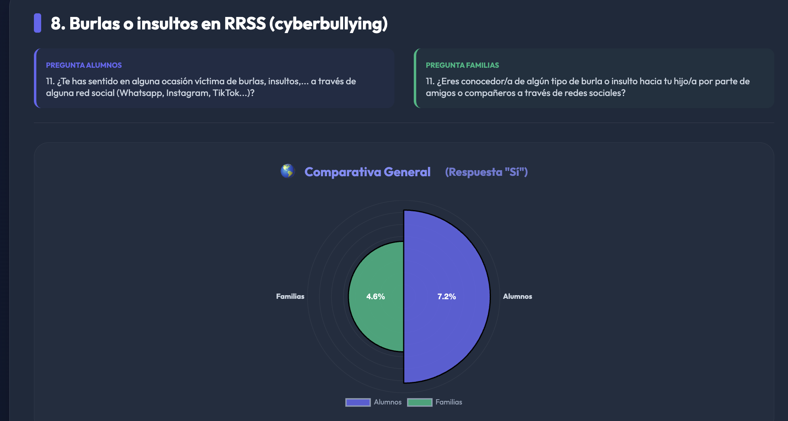
*Victimización ciberacoso — segmentación por sexo*

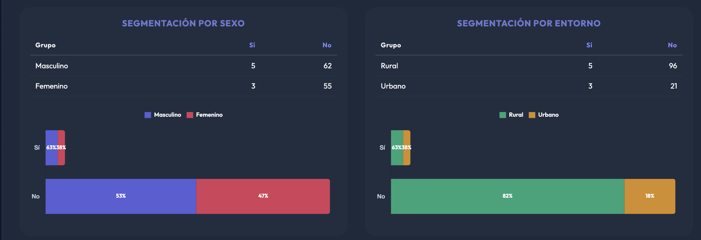
*Agresión digital — resultado global y segmentación por sexo*

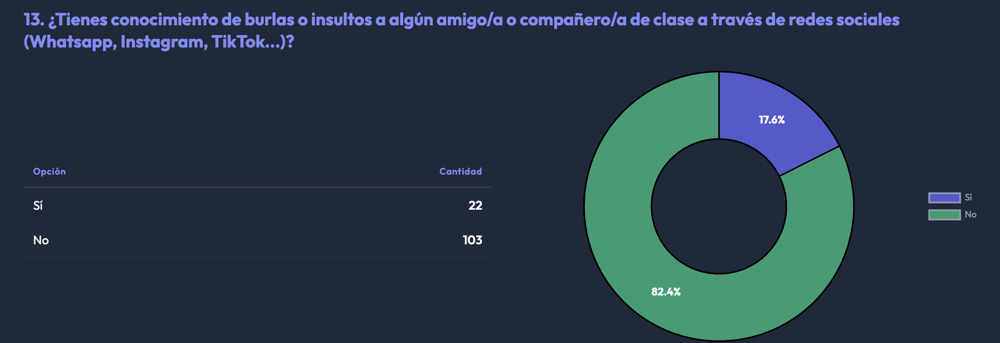
*Ciberacoso — correlación alumnado/familias (brecha de silencio)*

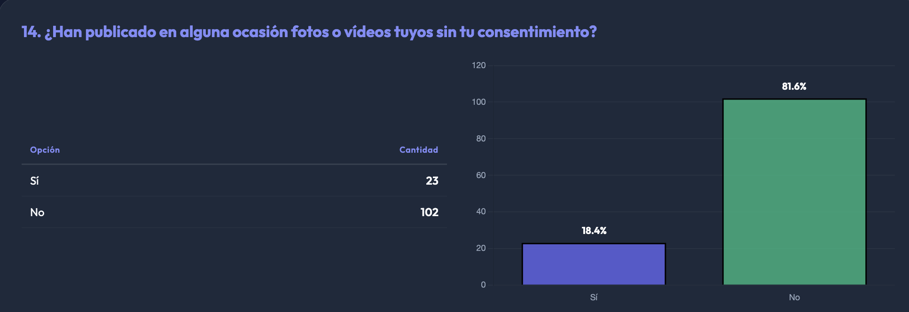
*Fotos/vídeos publicados sin consentimiento — resultado global*

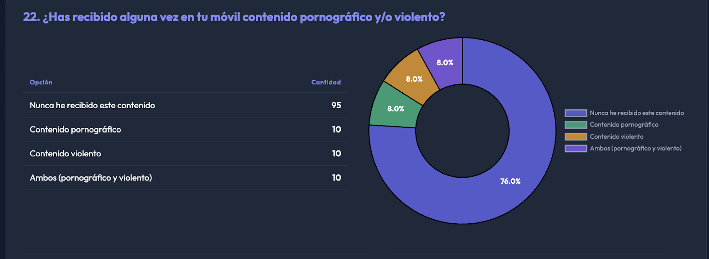
*Recepción de contenidos pornográficos/violentos — resultado global*

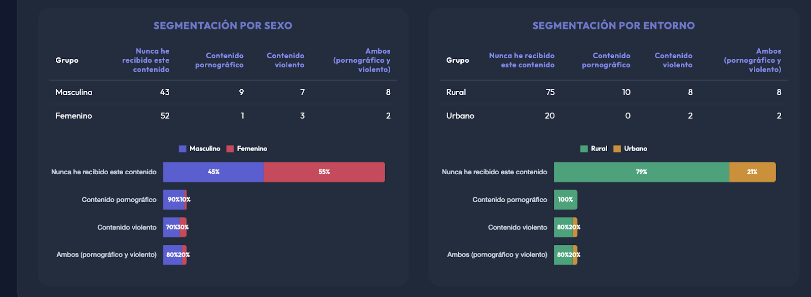
*Recepción de contenidos inapropiados — segmentación por sexo*

---

### 6. Acceso y hábitos de uso

> [STAT] **80%** tiene el móvil en su habitación mientras duerme.

> [STAT] **64,8%** se conecta después de medianoche (17,6% habitualmente, 47,2% a veces).

> [STAT] **79,2%** no usa el móvil durante las comidas — dato positivo que refleja hábitos familiares saludables.

> [STAT] **58,4%** tiene el móvil a mano mientras realiza las tareas escolares.

**Uso nocturno:** La luz azul de las pantallas retrasa la producción de melatonina, fragmentando el sueño y generando cansancio diurno. El uso nocturno es **10 puntos porcentuales mayor en entorno urbano** que en rural.

**Impacto en el estudio:** La simple presencia del teléfono, aunque no se use activamente, genera «atención dividida» y reduce la capacidad de concentración sostenida. Los chicos tienen el móvil a mano durante los deberes con mayor frecuencia (64%) que las chicas (51%).

**Brecha familias–alumnado:** El 43,5% de familias cree que sus hijos tienen el móvil cerca al estudiar, frente al 58,4% que realmente lo hacen. Más del 51% de los padres cree que sus hijos nunca se conectan después de medianoche.

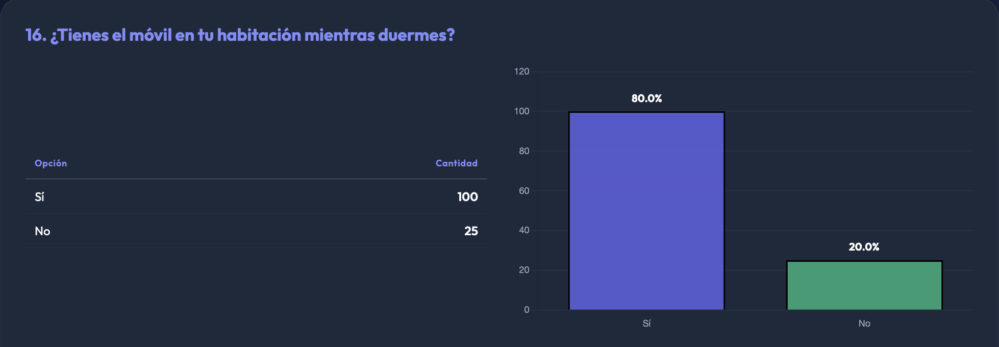
*Móvil en habitación al dormir — resultado global*

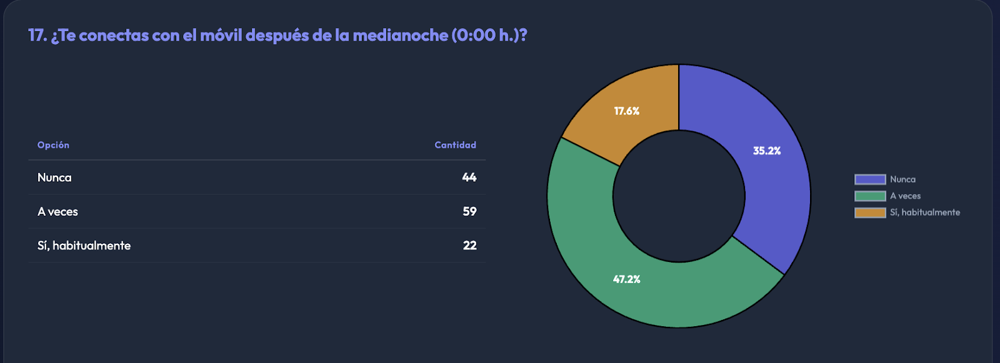
*Conexión después de medianoche — resultado global*

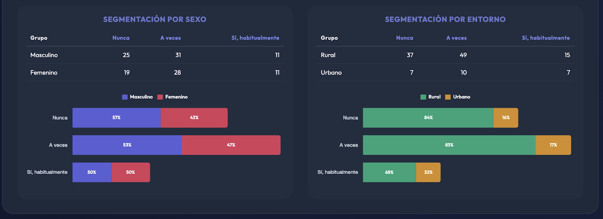
*Conexión después de medianoche — segmentación por entorno*

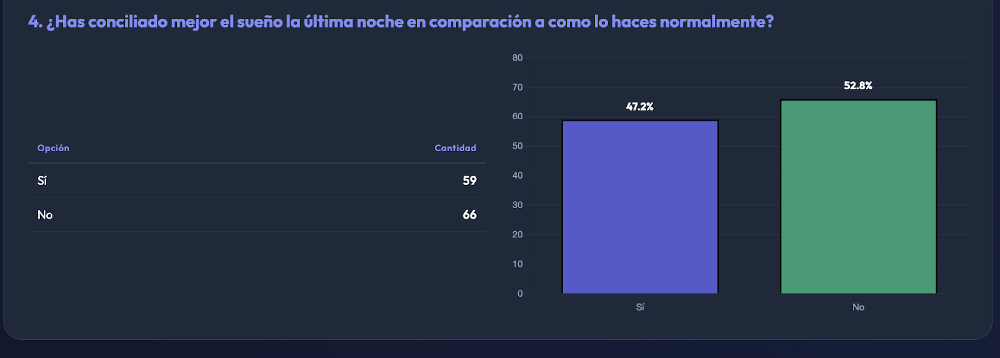
*Mejora del sueño durante las 24h de ayuno*

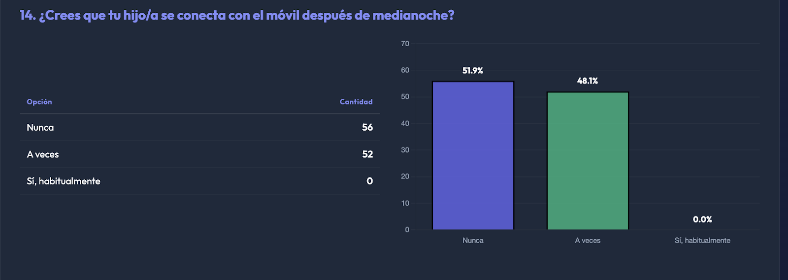
*Conexión nocturna — correlación alumnado/familias*

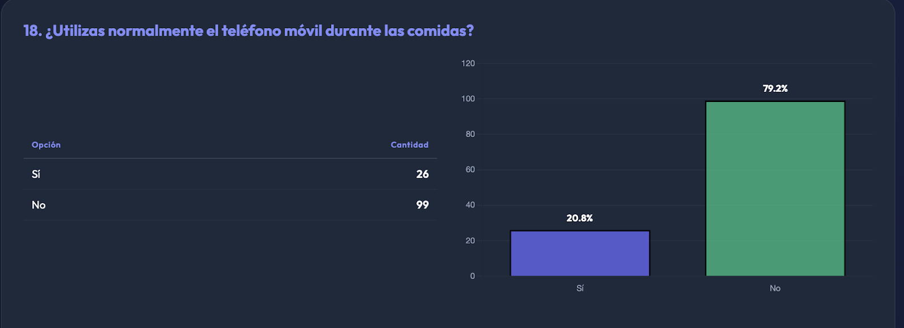
*Uso del móvil durante comidas — resultado global*

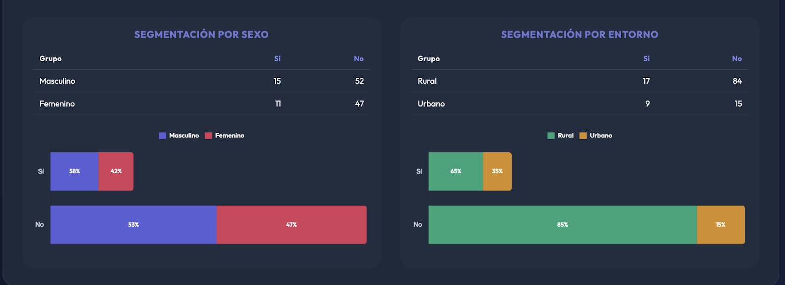
*Uso del móvil durante comidas — segmentación por entorno*

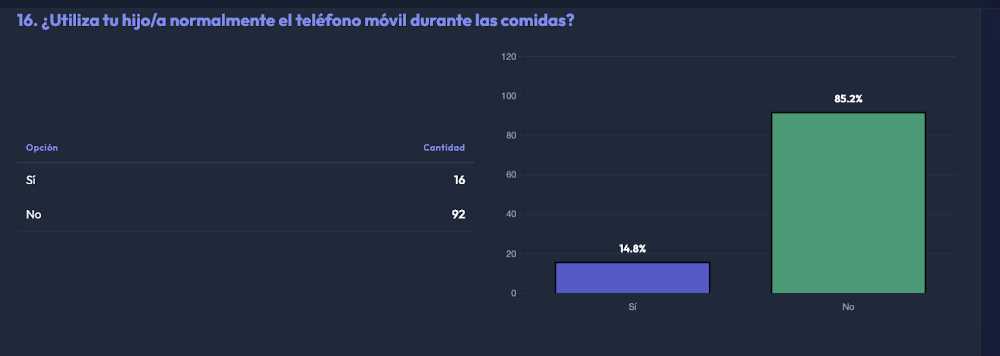
*Uso del móvil durante comidas — resultado familias*

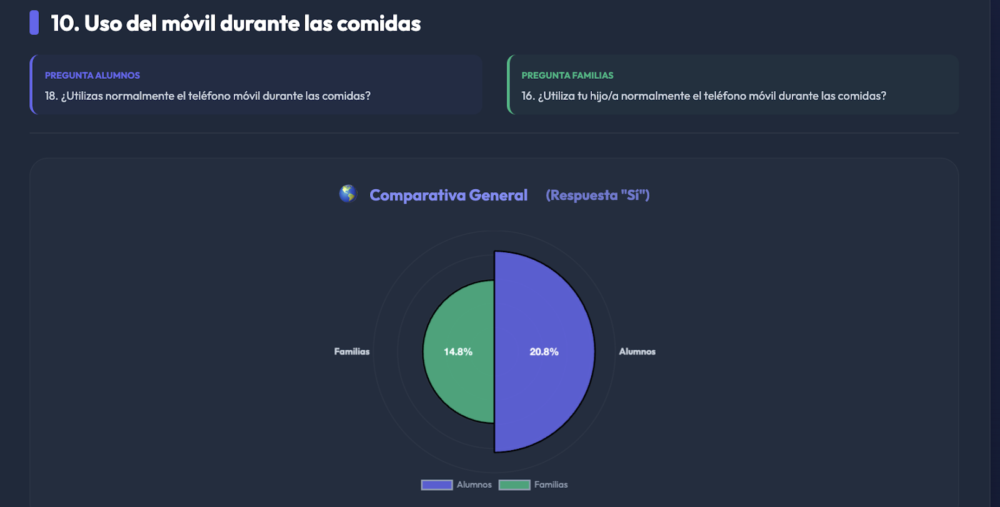
*Uso del móvil durante comidas — correlación alumnado/familias*

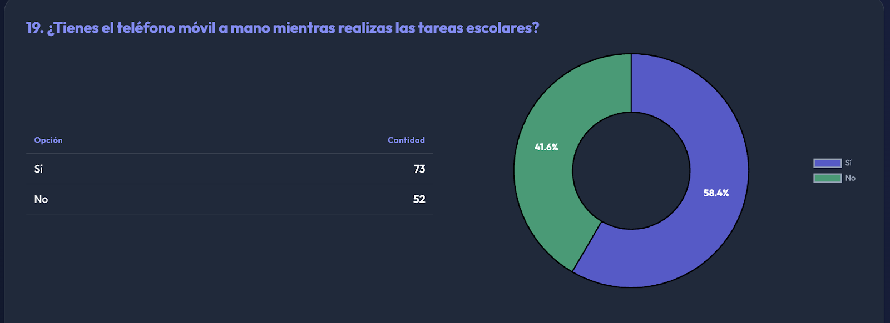
*Móvil durante tareas escolares — resultado global*

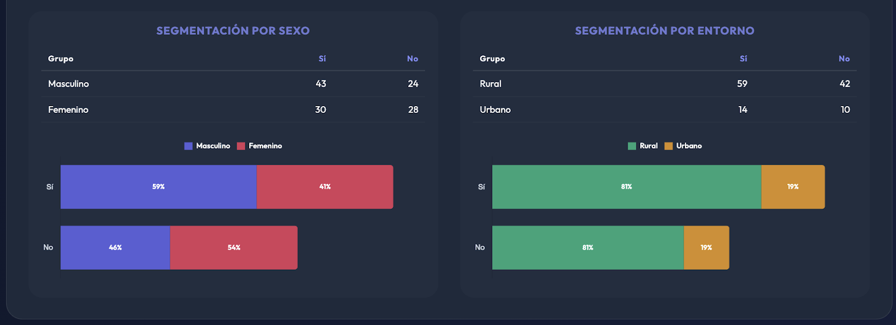
*Móvil durante tareas escolares — segmentación por sexo*

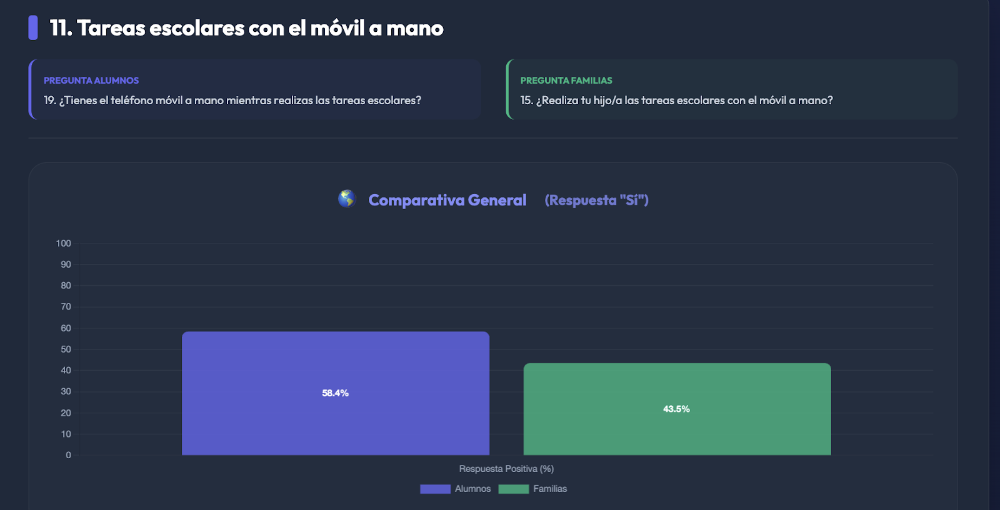
*Móvil durante tareas escolares — correlación alumnado/familias*


*Concentración en tareas escolares al retirar el móvil*

---

### 7. Contenidos y aplicaciones

**Ranking de aplicaciones más utilizadas:**

1. **Instagram y TikTok** — liderazgo compartido. Las chicas priorizan Instagram (autoexpresión); los chicos, TikTok (entretenimiento rápido).
2. **WhatsApp** — comunicación funcional y constante.
3. **YouTube** — entretenimiento e aprendizaje informal.
4. **Otras** (Spotify, Snapchat, X, Twitch...)
5. **Videojuegos** — menor prioridad general, pero el **82% de los chicos** juega con frecuencia frente al **18% de las chicas**.

> [STAT] **83,2%** de adolescentes juega al menos ocasionalmente con el móvil.

> [STAT] Solo el **24%** dejó de usar tecnología cuando se le retiró el móvil — el resto recurrió a otros dispositivos.

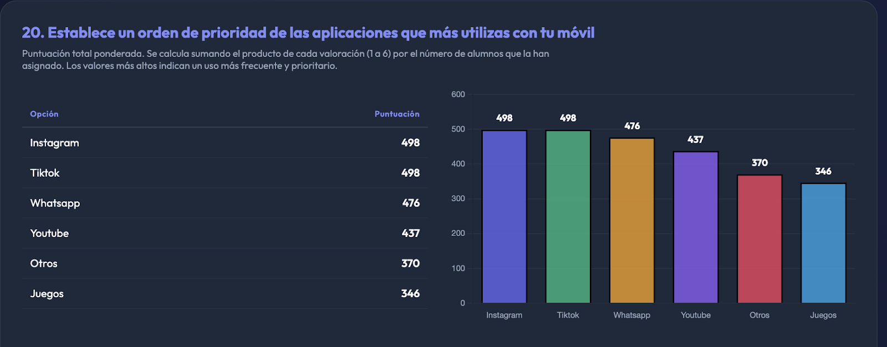
*Ranking de aplicaciones más utilizadas — global*

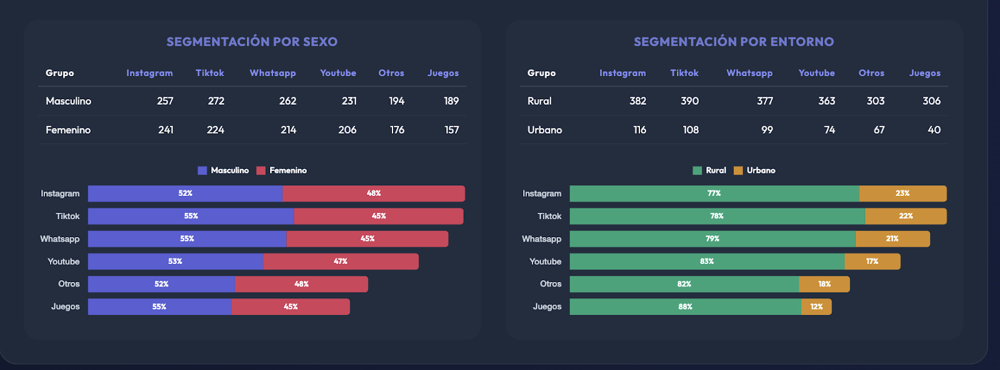
*Ranking de aplicaciones — segmentación por sexo*

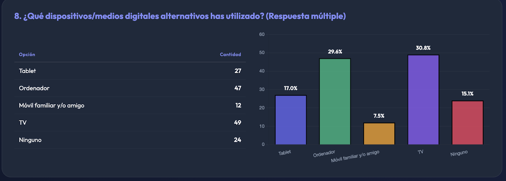
*Ranking de aplicaciones — segmentación por entorno*

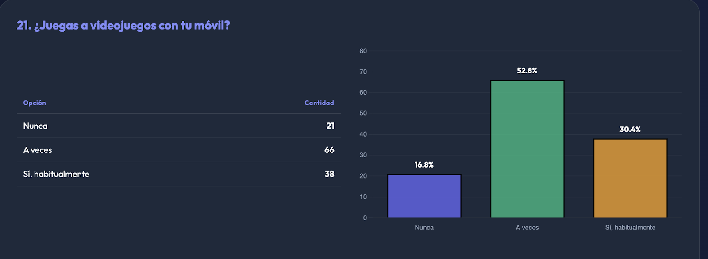
*Uso de videojuegos con el móvil — resultado global*

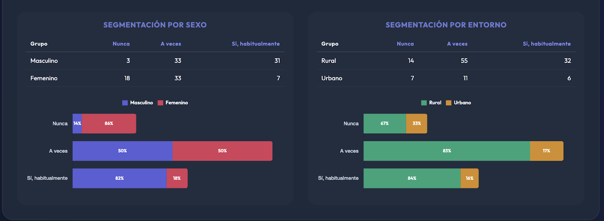
*Uso de videojuegos — segmentación por sexo*


*Dispositivos/medios digitales usados como sustitutos durante el ayuno*

---

### 8. Tiempo de uso

> [STAT] Media diaria: **5 horas** · **21,8%** usa el móvil entre 6 y 8 horas · **8,8%** supera las 10 horas diarias.

> [STAT] **65,6% de los alumnos** reconoce usar el móvil más tiempo del que debería. El **66,7% de los padres** coincide.

**Diferencias por sexo:** Los chicos usan el móvil una media de 5h 9min; las chicas, 4h 46min.

**Diferencias por entorno:** Entorno urbano: 5h 20min · Entorno rural: 4h 54min.

El perfil de mayor riesgo se encuentra entre **chicos en entornos urbanos**, aunque el uso intensivo es un fenómeno ampliamente extendido.

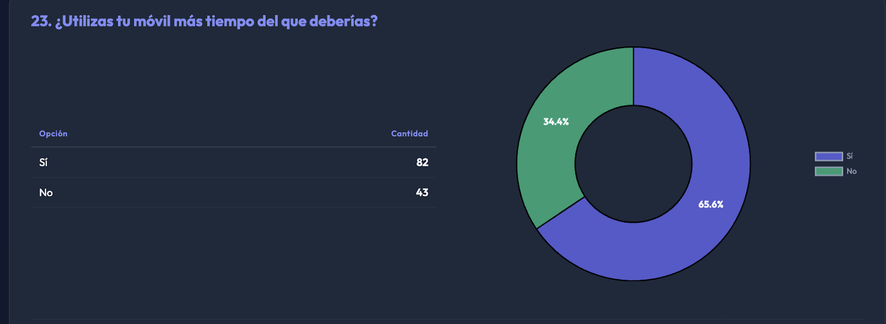
*Percepción de uso excesivo — resultado global alumnado*

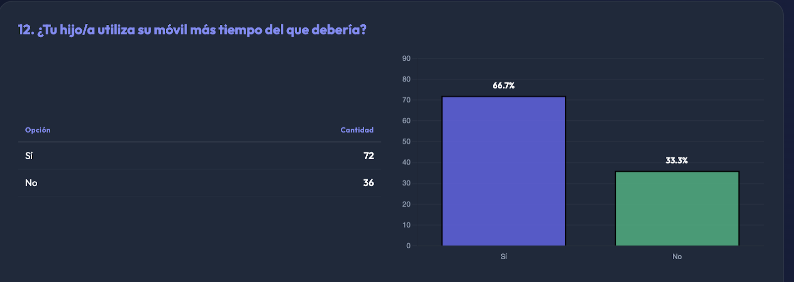
*Percepción de uso excesivo — correlación alumnado/familias*

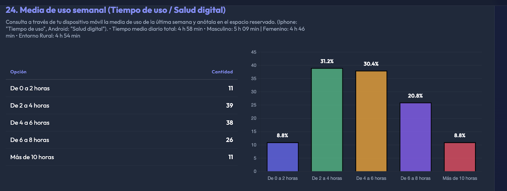
*Distribución del tiempo de uso diario*

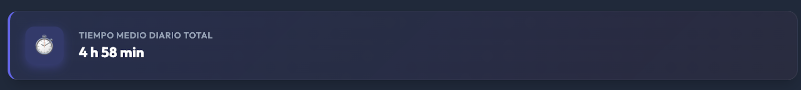
*Tiempo medio de uso — resultado global*

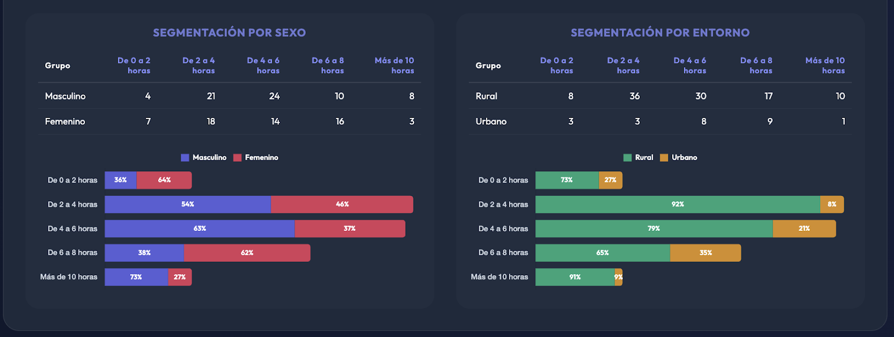
*Tiempo medio de uso — segmentación por sexo*

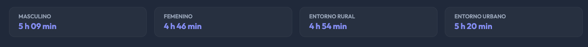
*Tiempo medio de uso — segmentación por entorno*

---

### 9. Tras 24 horas sin móvil

> [STAT] **37,6%** se aburrió sin el móvil — indicador claro de dependencia.

> [STAT] **76%** disfrutó de tener tiempo para otras actividades.

> [STAT] **50,4%** percibió que se concentró mejor en sus tareas escolares.

> [STAT] **47,2%** concilió mejor el sueño.

> [STAT] **42,4%** incrementó su ejercicio físico.

> [STAT] **50,4%** se sintió capaz de estar más de un día desconectado tras la experiencia.

#### En qué invirtieron el tiempo recuperado
El estudio fue la actividad prioritaria (27,9% de las respuestas), seguido de tiempo con la familia (23,2%), otras actividades y aficiones (21,9%) y deporte (17,6%).

#### Fenómeno de sustitución de pantallas
Solo el **15,1%** logró una desconexión digital total. El principal sustituto fue la Smart TV (30,8%), seguida del ordenador y la tablet. El dispositivo móvil es parte de un ecosistema digital más amplio.

#### Evolución respecto al estudio piloto
En el estudio piloto del IESO Vía Dalmacia (curso 2024–2025), el **64,7%** se aburrió. En esta muestra ampliada, ese porcentaje descendió al **37,6%**, lo que sugiere que al incluir entornos más diversos se encuentran perfiles con hábitos de ocio más variados.

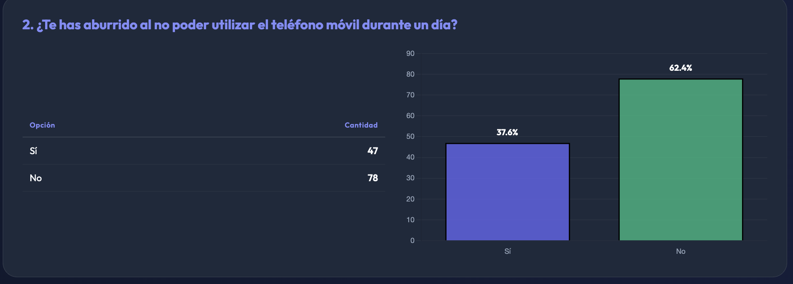
*Aburrimiento durante las 24h sin móvil*

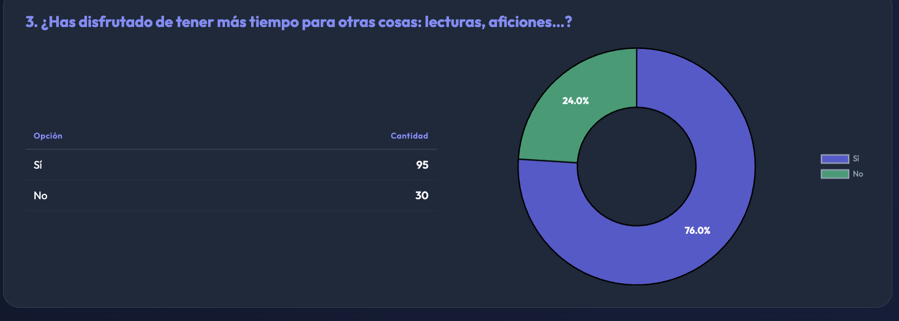
*Tiempo libre disfrutado para otras actividades*

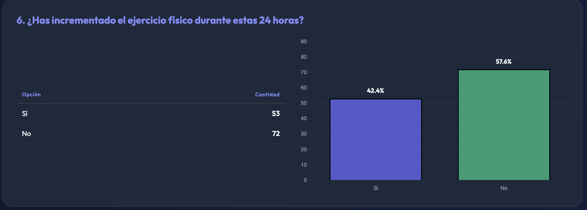
*Incremento de ejercicio físico durante el ayuno*

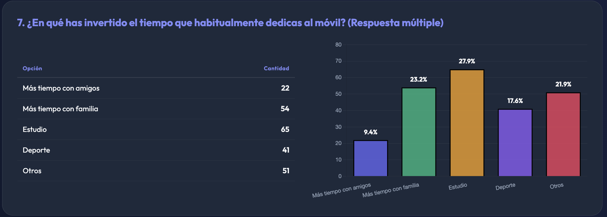
*Distribución de actividades con el tiempo recuperado*

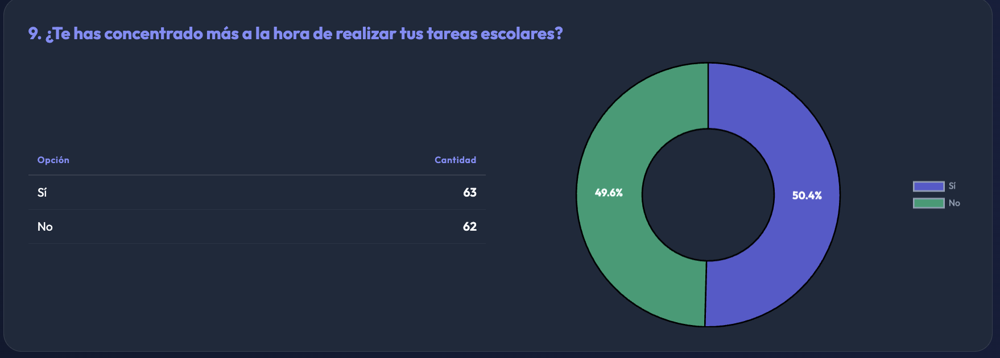
*Concentración en tareas escolares durante el ayuno*

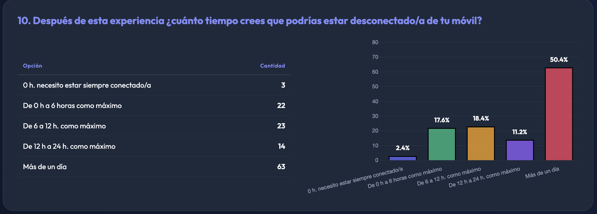
*Tiempo que estiman poder estar desconectados tras la experiencia*

---

## Conclusiones

### Uso del móvil y estado emocional
El teléfono móvil cumple una **función emocional y psicológica central** en la vida del adolescente. Se detectan indicadores claros de dependencia, especialmente en la consulta compulsiva de notificaciones y la ansiedad al no poder acceder al dispositivo. Las diferencias por sexo y entorno urbano son significativas.

### Relaciones familiares
Ocho de cada diez adolescentes reconocen que el móvil reduce su tiempo familiar. Existe una **profunda discrepancia** entre el control declarado por las familias y el percibido por los hijos. Las estrategias familiares deben evolucionar de la mera reprimenda hacia la **prevención, supervisión y acompañamiento digital**.

### Salud física
Las dolencias musculoesqueléticas y oculares no son síntomas aislados, sino señales de una falta de **higiene digital**. Con una prevalencia del 44% en dolor cervical y 26,4% en molestias oculares, el impacto ergonómico es significativo, con mayor vulnerabilidad en adolescentes femeninas.

### Ciberacoso: la brecha de silencio
El **95,4% de los padres desconoce** si sus hijos sufren agresiones digitales. Los adolescentes callan por miedo a perder el dispositivo. Esta «bolsa de silencio» es el riesgo más grave identificado en el estudio: deja a los jóvenes solos ante la violencia digital.

### Eficacia del ayuno digital
El experimento demostró ser una **herramienta educativa potente**. El 50,4% de los alumnos se sintió capaz de prolongar la desconexión más allá de un día, lo que indica un éxito en la toma de conciencia. Sin embargo, la persistencia de la nomofobia en la otra mitad refuerza la necesidad de programas continuos de Educación para la Salud Digital.

---

## Propuestas de acción

### En el ámbito escolar

- **Entrenamiento en gestión de la atención:** educar sobre cómo las notificaciones fragmentan la concentración y promover el uso de herramientas digitales en horarios cerrados.
- **Campañas sobre el descanso:** relacionar el uso nocturno del móvil con el rendimiento escolar y el cansancio.
- **Concienciación sobre higiene postural:** impacto de la postura inclinada en las vértebras cervicales.
- **Talleres para familias:** encuentros informativos sobre impacto del móvil, herramientas de control parental y resultados del propio estudio.
- **Retos de desconexión digital:** el reto «7 noches sin móvil» con registro diario y puesta en común en tutoría.
- **Ayunos digitales periódicos:** repetir el ejercicio de desconexión voluntaria como herramienta preventiva.

### En el ámbito familiar

- **Preservar el descanso nocturno:** depositar el móvil fuera de la habitación antes de dormir.
- **Establecer horarios diferenciados** entre uso educativo y recreativo.
- **Predicar con el ejemplo:** los adultos deben limitar su propio uso en momentos compartidos (comidas, actividades familiares).
- **Crear espacios libres de tecnología** en el hogar y «cajas de desconexión» durante actividades en familia.
- **Supervisión activa no invasiva:** usar herramientas de control parental (como Family Link) acompañadas de diálogo abierto, no de control autoritario.
- **Fomentar la confianza y el diálogo:** evitar que el castigo sea siempre retirar el móvil, ya que esto incentiva el silencio ante el acoso.
- **Contratos familiares de uso:** normas consensuadas sobre contenido y comportamiento ético en línea.
- **Promover el ocio activo:** el ejercicio regular reduce los niveles de dependencia tecnológica.

### En el ámbito institucional

- **Educación en ética digital:** integrar en el currículo la alfabetización mediática, la empatía y la responsabilidad online.
- **Enseñar el funcionamiento de los algoritmos** para que los jóvenes comprendan cómo influyen en lo que consumen.
- **Protocolos de detección precoz:** capacitar al profesorado para identificar señales de distrés psicológico derivadas del móvil.
- **Coordinación multidisciplinar:** centros educativos, servicios sanitarios (pediatría), fuerzas de seguridad y servicios sociales.
- **Exigir entornos seguros:** impulsar medidas legales para que las plataformas garanticen el *safety by design* y sistemas de verificación de edad efectivos.
- **Equiparar la violencia digital** a la física en términos de protección jurídica e institucional.
- **Programas de ayuda entre iguales (PAI):** actualizar los Planes de Convivencia para incluir mediación escolar y actuación sobre la comunidad de testigos.

---

## Metodología de los cuestionarios

### Cuestionario 1 — Previo al ayuno (alumnado)
24 preguntas | Noviembre–diciembre 2025
[Ver cuestionario completo en Anexo I]

**Áreas:** Segmentación por sexo y entorno · Estado de ánimo · Relaciones familiares · Salud · Ciberacoso · Acceso al móvil · Contenidos · Tiempo de uso

### Cuestionario 2 — Posterior al ayuno (alumnado)
10 preguntas | Inmediatamente tras la devolución del dispositivo
[Ver cuestionario completo en Anexo II]

**Áreas:** Inquietud durante la desconexión · Aburrimiento · Ocio alternativo · Calidad del sueño · Tiempo con familia · Ejercicio físico · Concentración escolar · Capacidad de desconexión futura

### Cuestionario 3 — Familias
16 preguntas | Enviado a progenitores de los participantes
[Ver cuestionario completo en Anexo III]

**Áreas:** Segmentación por sexo y entorno · Estado de ánimo del hijo/a · Relaciones familiares · Salud percibida · Ciberacoso · Acceso al móvil

---

## Bibliografía seleccionada

- Arab, E. & Díaz, A. (2015). Impacto de las redes sociales e internet en la adolescencia. *doi: 10.1016/j.rmclc.2014.12.001*
- INE (2023). Encuesta sobre Equipamiento y Uso de TIC en los Hogares.
- Microsoft (2023). Informe de Seguridad Online: el 74% de adolescentes ha experimentado algún riesgo en internet.
- OMS (2023). La seguridad de la infancia y la juventud en la red.
- UNICEF (2025). Infancia, adolescencia y bienestar digital. *unicef.es*
- Vicente-Escudero, J.L. et al (2019). Adicción al móvil e internet en adolescentes. *doi: 10.24310/espsiescpsi.v12i2.10065*
- Junta de Extremadura (2024). Instrucción n.º 3/2024 sobre uso de dispositivos electrónicos en centros docentes de Extremadura.

---

## Agradecimientos

A los **125 estudiantes** que aceptaron el reto de la desconexión con honestidad y valentía. A las **familias**, por su confianza y participación. A los **equipos directivos y docentes** de los ocho centros participantes, cuya implicación hizo posible este proyecto.

Agradecimiento especial a la **UPE de Cáceres** y a los **CPR de Coria, Hoyos y Plasencia** por su respaldo institucional y mediación con la comunidad docente.

---

---

## Guía de publicación gratuita con GitHub Pages

> **Nota para el desarrollador:** Esta sección describe cómo publicar la web de forma gratuita usando GitHub Pages. Es la opción más adecuada para este proyecto porque es un sitio estático (HTML + CSS + imágenes) sin necesidad de servidor ni framework. No requiere tarjeta de crédito y no caduca.

### Por qué GitHub Pages y no Vercel

| | GitHub Pages | Vercel (gratuito) |
|---|---|---|
| Coste | Gratuito sin límites | Gratuito con límites de ancho de banda |
| Ideal para | HTML/CSS estático | Proyectos con frameworks (Next.js, etc.) |
| Complejidad | Mínima | Requiere configuración de build |
| Dominio gratuito | `usuario.github.io/proyecto` | `proyecto.vercel.app` |
| Tarjeta de crédito | No | No |

Para una web estática generada como HTML/CSS plano, **GitHub Pages es suficiente, más sencillo y no tiene ningún coste oculto.**

---

### Paso 1 — Preparar los archivos localmente

La web generada por Gemini debe tener esta estructura mínima:

```
nombre-del-proyecto/
├── index.html          ← página principal
├── style.css           ← estilos (o embebido en el HTML)
├── assets/
│   └── graficos/       ← aquí van todos los gráficos del estudio
│       ├── grafico_01_sexo_entorno.png
│       ├── grafico_02_nerviosismo.png
│       └── ...
└── README.md           ← opcional, descripción del repositorio
```

**Importante al pedirle a Gemini que genere la web:**
- Pídele que las imágenes se referencien con rutas relativas: `assets/graficos/nombre.png`
- Pídele que todo quede en un único `index.html` o en archivos planos (sin Node.js, sin npm)

---

### Paso 2 — Crear una cuenta en GitHub

1. Ir a [github.com](https://github.com) y crear una cuenta gratuita (si no se tiene ya).
2. Verificar el correo electrónico.

---

### Paso 3 — Crear el repositorio

1. En GitHub, hacer clic en **"New repository"** (botón verde `+` > *New repository*).
2. Configurar así:
   - **Repository name:** `estudio-salud-digital` (o el nombre que se prefiera, sin espacios ni tildes)
   - **Visibility:** `Public` ← obligatorio para GitHub Pages gratuito
   - Marcar **"Add a README file"**
3. Clic en **"Create repository"**.

---

### Paso 4 — Subir los archivos

**Opción A — Desde el navegador (más sencilla, sin instalar nada):**

1. En el repositorio recién creado, clic en **"Add file" > "Upload files"**.
2. Arrastrar todos los archivos del proyecto (index.html, style.css, carpeta assets/).
3. En el campo de mensaje escribir: `Subida inicial del estudio`.
4. Clic en **"Commit changes"**.

**Opción B — Con GitHub Desktop (recomendada si se van a hacer actualizaciones frecuentes):**

1. Descargar [GitHub Desktop](https://desktop.github.com) e instalarlo.
2. Clonar el repositorio recién creado.
3. Copiar los archivos del proyecto a la carpeta clonada.
4. En GitHub Desktop: escribir un mensaje de commit > **"Commit to main"** > **"Push origin"**.

---

### Paso 5 — Activar GitHub Pages

1. En el repositorio de GitHub, ir a **Settings** (pestaña con engranaje).
2. En el menú lateral izquierdo, clic en **"Pages"**.
3. En el apartado **"Branch"**, seleccionar `main` y la carpeta `/ (root)`.
4. Clic en **"Save"**.
5. Esperar 1–2 minutos. GitHub mostrará el mensaje:

   > *"Your site is live at https://tuusuario.github.io/estudio-salud-digital/"*

La URL definitiva será:
```
https://tuusuario.github.io/estudio-salud-digital/
```

---

### Paso 6 — Actualizar la web (cuando se hagan cambios)

- **Desde el navegador:** ir al archivo que se quiere cambiar en GitHub > clic en el lápiz (editar) > guardar con "Commit changes".
- **Con GitHub Desktop:** modificar el archivo localmente > commit > push. Los cambios se publican en 1–2 minutos automáticamente.

---

### Dominio personalizado (opcional, gratuito con algunos registradores)

Si se quiere una URL propia como `estudiodigitalextremadura.es`:

1. Comprar el dominio en cualquier registrador (Nominalia, Namecheap, etc.).
2. En el DNS del dominio, añadir un registro `CNAME` apuntando a `tuusuario.github.io`.
3. En **Settings > Pages > Custom domain**, escribir el dominio propio.
4. GitHub gestiona automáticamente el certificado HTTPS (gratuito).

---

### Resumen del flujo completo

```
Gemini genera HTML/CSS  →  Guardar archivos localmente
        ↓
Crear repositorio público en GitHub
        ↓
Subir archivos (navegador o GitHub Desktop)
        ↓
Settings > Pages > Branch: main > Save
        ↓
Web publicada en https://tuusuario.github.io/estudio-salud-digital/
```

**Tiempo estimado total: 15–20 minutos** para alguien sin experiencia previa.

---

*Borrador · Estudio realizado en el curso 2025–2026 · Zona noroeste de Extremadura*
